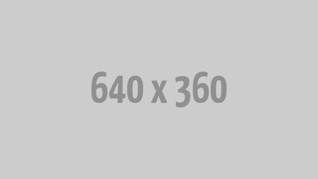

# Datasketch Store

## Store Description:

Datasketch Store is an impact design store that seeks to democratize access to citizens' knowledge and data on topics of public debate in our society. Our products use open technologies that make it possible to visualize social problems, such as gender equality, the fight against corruption, human rights and the environment.

We are a multidisciplinary, diverse, creative and feminist team, which is an effective instrument to activate citizenship and disseminate messages that allow us to make better decisions as a society.

We move fashion and design as an innovative element that brings together the economic, social and cultural in a single space to question our perceptions, habits and attitudes of our daily lives. Fashion can go beyond appearances or stereotypes and is an effective vehicle to reconfigure our social system and cultural identity.

Find out more in out [Manifiesto - Spanish version](manifiesto.md)

Find out more in out [Manifesto - English version](manifiesto.md)

## Where to buy the designs:

**Colombia**

[Datasketch Store](https://datasketch.store)

**United States and Europe**

Buy them through our [teespring store](https://teespring.com/stores/datasketch)

## Licensing

All the designs in this repository, when not stated otherwise, is licensed CC-BY-SA. References and adaptations of this page please link and reference this page, our [Store](http://datasketch.store) or our data journalism project [Datasketch](http://datasketch.co).

# Datasketch Store

## Descripción de la tienda

Datasketch Store es una tienda de diseño de impacto que busca democratizar el acceso al conocimiento e informar a la ciudadanía sobre temas críticos de debate público en nuestra sociedad. Nuestros productos usan tecnologías abiertas que permiten visibilizar problemáticas sociales, como la igualdad de género, la lucha anticorrupción, los derechos humanos y el medio ambiente.

Somos un equipo multidisciplinar, diverso, creativo y feminista, conscientes de que el uso de datos y visualizaciones son un instrumento efectivo para activar a la ciudadanía y difundir mensajes que nos permitan tomar mejores decisiones como sociedad.

Nos mueve la moda y el diseño como elemento innovador que reúne lo económico, lo social y lo cultural en un único espacio para cuestionar nuestras percepciones, hábitos y actitudes de nuestra cotidianidad. La moda puede ir más allá de las apariencias o los estereotipos y es un vehículo efectivo para reconfigurar nuestro sistema social e identidad cultural.

Encuentra mas en nuestro [Manifiesto - Spanish version](manifiesto.md)

Encuentra mas en nuestro [Manifesto - English version](manifiesto.md)

## Donde puedes comprar nuestros diseños:

**Colombia**

[Datasketch Store](https://datasketch.store)

**Estados Unidos y Europa**

Compra nuestros diseños por [teespring store](https://teespring.com/stores/datasketch)

## Licencias

Todos los diseños en este repositorio, cuando no se indique lo contrario, tienen licencia CC-BY-SA. Las referencias y adaptaciones de esta página, por favor, enlace y referencia esta página, nuestra [Tienda](http://datasketch.store) o nuestro proyecto de periodismo de datos [Datasketch](http://datasketch.co).
